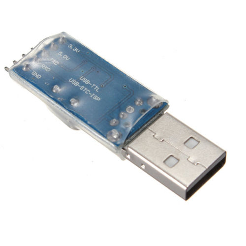
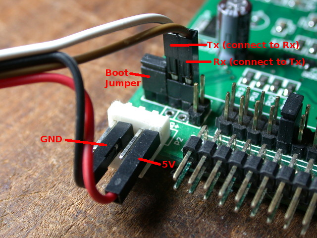
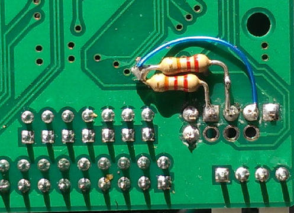

The first installation of this firmware onto Gotek can be done either
by [serial](#method-1-serial-programming) or
[USB](#method-2-usb-programming) link to a host PC.

## Method 1: Serial Programming

A nice video summary of this method using programming software on
Windows is available on Youtube courtesy of Kris Cochrane. It also
includes the [OLED Display](Hardware-Mods#oled-display) and
[Piezo Sounder](Hardware-Mods#speaker) mods:

[](http://www.youtube.com/watch?v=-K31S2xqZIk "FlashFloppy custom firmware install")

Serial programming requires a USB-TTL adapter, readily available on
Ebay or from project webstores:
- [CAB-12977 from SparkFun](https://www.sparkfun.com/products/12977)
- Search "PL2303HX usb ttl adapter" on Ebay, available for around one dollar.



The Gotek is then jumpered in system-bootloader mode and programmed
from the host PC. See the below picture for wiring and jumper
selection. This Gotek has had pins soldered to the programming
header. It is possible to make the required connections with no
soldering, but be careful that all wires are sufficiently well
connected. Also note that the ordering of the connections
(5V,GND,TX,RX) can vary across adapters, so be careful to note the
ordering on your own.



The programming process is described, along with suitable
Windows software, on the
[Cortex firmware webpage](https://cortexamigafloppydrive.wordpress.com).
Of course, rather than using the Cortex HEX file, use the ***.hex** file
contained in the FlashFloppy distribution.

If programming on Linux, you can follow the Cortex instructions to
physically set up your serial connection and bootstrap the Gotek, and
then use stm32flash to do the programming (for v0.10 in this example):

```
 # sudo stm32flash -k /dev/ttyUSB0
 # sudo stm32flash -vw FF_Gotek-v0.10.hex /dev/ttyUSB0
```

### Troubleshooting
- On Windows, ensure the driver has correctly detected the USB-TTL
  adapter. In particular, PL2303 clones have trouble with the official
  Prolific driver.
- Ensure you have TX and RX wires the correct way round.
- Sometimes the STM32 bootloader gets confused or negotiates the wrong
  baud rate. Try resetting the Gotek by touching NRST to GND, or
  by removing and reapplying power.
- Some serial adapters require pull-up resistors on the TX and RX
  wires. See [AN2606 ("STM32 microcontroller system memory boot
  mode")][an2606], Section 3.3, Figure 1. A suitable resistor value
  (R) is 10K; these can safely be connected to VCC/+V of 3.3V or 5V.



## Method 2: USB Programming

This method requires a USB-A to USB-A cable, a pair of jumper wires to
configure the programming header of the Gotek, and the ***.dfu**
programming file contained in the FlashFloppy distribution.

### Windows

For more details watch the following Youtube video. **Note:** The
***.dfu** file is now included in the FlashFloppy distribution; there
is no need to create it from the ***.hex** file and those steps can be
skipped.

[](http://www.youtube.com/watch?v=yUOyZB9cro4 "Flash Gotek without Serial Adapter")

### Linux / Mac

Firstly, set the programming jumpers as described in the Windows tutorial
video, above. Ignore the rest of the video, which is Windows-specific.

Connect the Gotek to your host using a USB-A to USB-A cable. 

Programming requires the `dfu-util` command-line tool which can be
downloaded via your package manager (Linux), or Homebrew (on
MacOS). Programming is then as simple as (for v0.10 in this example):
```
sudo dfu-util -a 0 -s :unprotect:force -D FF_Gotek-v0.10.dfu
sudo dfu-util -a 0 -D FF_Gotek-v0.10.dfu
```

The first line is only needed if the Gotek Flash is read-protected (this
is the case for factory-fresh Goteks). Since the `unprotect` command resets
the Gotek, you may need to wait some seconds before issuing the second
command, while the DFU device is re-enumerated.

There are reports of some issues connecting as a DFU device to
MacOS. In some cases this can be solved by connecting via an external
USB hub.

[an2606]: http://www.st.com/resource/en/application_note/cd00167594.pdf
