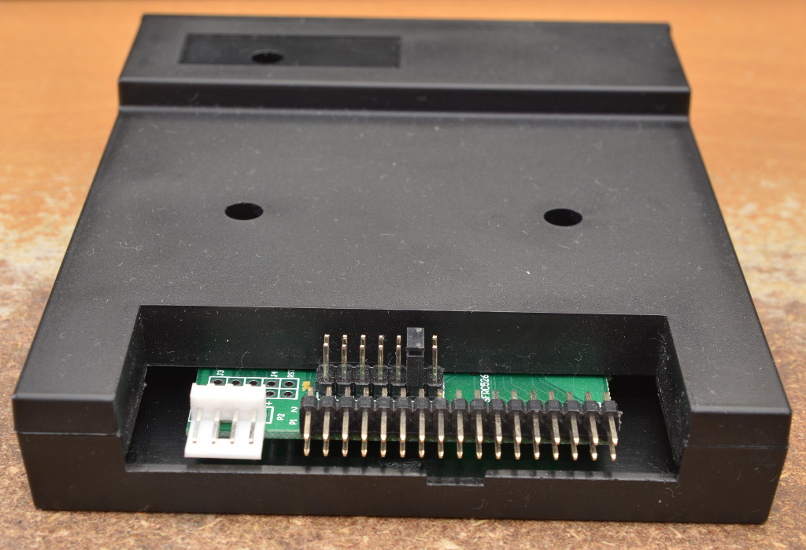
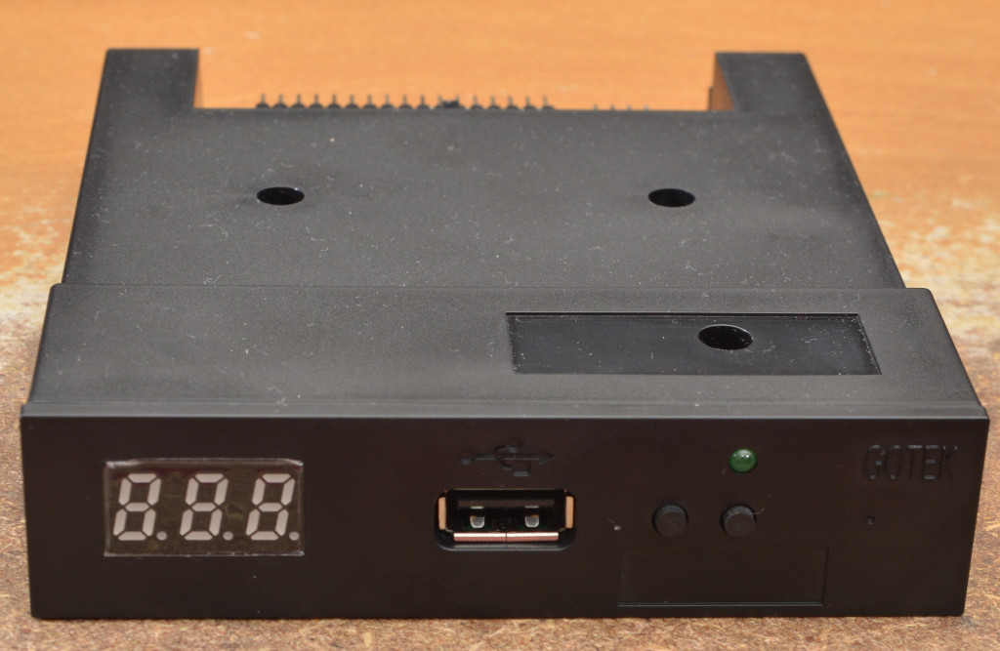

FlashFloppy is compatible with any Gotek device with a 34-pin header,
all of which share the SFR model prefix (eg SFR1M44-U100K,
SFRM72-U100; though not all sellers mention the model name
explicitly). These 34-pin models all share the same basic design,
varying only in preinstalled firmware and user interface (display and
buttons). Since the fixed-format (720kB vs 1.44MB) stock firmware is
being replaced, this particular distinction between Gotek models is
irrelevant: all of them can handle an almost infinite range of disk
formats with FlashFloppy installed.

Unless performing display and rotary encoder
[upgrades](Hardware-Mods), choose a model with three-digit LED
display. Be aware that the very cheapest models often have no display
and buttons, which makes disk changes impossible unless you install
your own alternatives. There also exist some older models with a
two-digit LED display: although compatible, try to avoid these.

## Models to Avoid

- **UFA prefix** (eg UFA1M44): Emulates a USB floppy drive and hence
  lacks the 34-pin header, which is replaced by a mini-USB socket.
- **DU26, TU26 suffix** (eg SFR1M44-DU26): Emulates a slimline laptop
  drive, and hence has 26-pin header with integrated power, rather
  than the required 34-pin header. However, see [#155][issue-155] for
  one user's successful modifications to run FlashFloppy on a DU26.

[issue-155]: https://www.github.com/keirf/FlashFloppy/issues/155