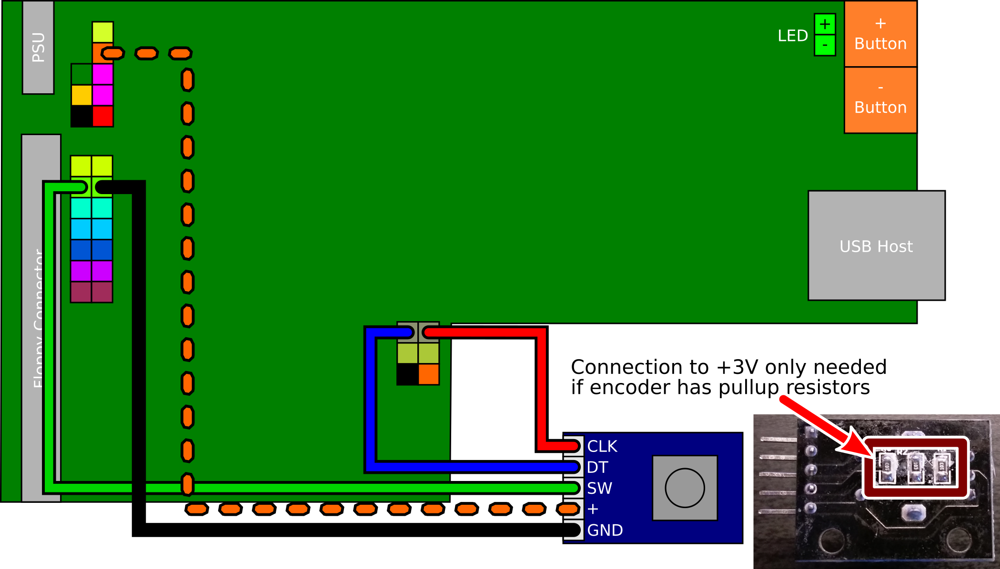

- [Board Layout](#board-layout)
- [Speaker](#speaker)
- [Select/Eject/Insert Button](#selectejectinsert-button)
- [LCD Display](#lcd-display)
- [OLED Display](#oled-display)
- [Rotary Encoder](#rotary-encoder)
- [Blackberry Trackball](#blackberry-trackball)
- [Motor Signal](#motor-signal)
- [Enhanced Gotek](#enhanced-gotek)

## Board Layout

Most modifications simply involve plugging new hardware add-ons into
pin headers on the Gotek PCB. The PCB layout is summarised below. We
will refer to this diagram for each hardware mod.

## Speaker

A speaker can be attached to the Gotek to sound whenever the drive
heads move. The simplest method is to connect a piezo sounder
directly to the JB header pins.

There is also a step-by-step video describing this mod:

If you want to connect a magnetic speaker instead, you must buffer via
an NPN transistor. If you don't know what this means just be sure to
use a piezo sounder, easily found on Ebay, and connect it directly as
shown above.

## Select/Eject/Insert Button

Also known simply as the Select button, FlashFloppy supports a third
button in addition to the basic up/down controls. This should be a
standard momentary microswitch, connected to the header pins JA.

The button's effect depends on the current state of operation:
- When selecting an image, the button will immediately select the
  currently-selected image
- When an image is inserted, the button will immediately eject it
- When an image is ejected, the button will immediately insert it

## LCD Display

As an alternative to the Gotek 7-segment display, FlashFloppy supports
the ubiquitous two-row LCD with I2C backpack board. These are available
from many Ebay sellers in compatible sizes from 16x2 up to 40x2
characters.

You can locate the required connections on your Gotek PCB as
below. These connect to the corresponding header pins on your LCD I2C
backpack module.

The SCL and SDA lines must be connected to VCC ("pulled up" to VCC)
via 4.7k resistors.  Note that many I2C boards have the pullup
resistors on board and in this case you do not need to attach your own
external pullups. You can confirm this by checking the resistance
between SDA/SCL and VCC. If it is less than 10k you do not need to add
pullups.

If you do require the pullup resistors, these can be soldered to the
backside of the Gotek PCB between VCC and each of SDA and
SCL. Alternatively the resistors can be soldered to the back of the
I2C module header.

## OLED Display

Another alternative to the Gotek 7-segment display is a 0.91" 128x32
display, as sold for Arduino projects by many Ebay sellers. You will
require a display with I2C interface: you should see it has a 4-pin
header marked GND, VCC, SCL, SDA.

These displays can simply connect to the 7-segment display's header,
reusing the existing jumper wires.

I2C 128x64 monochrome displays are also compatible. The usual sizes
are 0.96" and 1.3". The 1.3" size needs a line in [FF.CFG][ffcfg]:
`display-type = oled-128x64-sh1106`.

## Rotary Encoder

As an alternative to using the up/down buttons you can instead connect
a rotary encoder. The pictures below show how to connect it, either
directly or via a PCB module (eg KY040).

When connecting via a PCB module, you may need to connect to 3.3v if
the board has pull-up resistors mounted.

If connecting directly note that by convention GND is always the
middle pin in the row of three. If there is a further row of
two pins then these are connected to an internal push switch: you can
wire these pins to jumper JA to use the switch as a
[Select/Eject/Insert button](#selectejectinsert-button).

Rotating the dial should now have the same effect as pushing the
buttons: anti-clockwise for down, and clockwise for up.

Troubleshooting:
- Directional controls are inverted: swap the A and B (aka CLK, DT) wires.
- Four clicks are required to move a single step: specify
  `rotary=gray` in [FF.CFG][ffcfg]
- PCB modules only: Both directions move up (or down):
  - Connect + to 3.3V (marked in picture above); or
  - Remove pull-up resistors from the back of the PCB; or
  - Remove the encoder from the PCB and solder wires directly.

## Blackberry Trackball

A neat alternative to a rotary encoder is the Blackberry-style miniature
trackball. These can be found on Ebay and AliExpress for a few dollars.
Unfortunately they are tricky to fit to a standard Gotek front panel due
to the size of their PCB; however, they are an interesting option for
custom designs.

Wiring is very similar to the PCB-based rotary encoder. With reference
to the lines in the encoder's wiring diagram:
- VCC connects to 3.3V (dashed orange)
- GND connects to ground (black)
- BTN connects to JA (green)
- LEFT/RIGHT (*or* UP/DOWN) connect to the rotary pins (blue/red).

You will additionally require `display-type = trackball` in [FF.CFG][ffcfg].

Here is a video demonstrating the trackball in action: 

## Motor Signal

The new [FF.CFG][ffcfg] `motor-delay` option allows for emulation of correct
motor behaviour: the Gotek drive does not report it is 'ready' until some
milliseconds after it is ordered to spin up the drive motor.

However, standard Gotek does not internally connect to the motor signal, and
the following modification is required to:
1. Pull Gotek interface pin 16 up to 5v via a 1k resistor
2. Connect Gotek interface pin 16 to STM32F105 pin 36 (PB15)

STM32 pin 36 is connected to pin 5 of the unoccupied SPI Flash footprint
on the Gotek PCB. This is the easiest point to solder a wire to, as shown
below:

The other end of this wire is soldered to pin 16 of the floppy header. A
1k resistor must also be soldered from pin 16 to the 5v rail. See below
(the resistor is hidden in heatshrink tubing):

## Enhanced Gotek

Gotek clone designers can choose to add various enhancements to the
standard Gotek, all supported by the FlashFloppy firmware. Note that
these instructions are intended for PCB designers and cannot be
retrofitted to a standard Gotek without fine soldering skills. Regular
Gotek users should therefore skip this section.

### Summary

- **PC12-15:** Board Identifier
- **PA3:** Second Drive Select
- **PA15:** Motor-On Signal
- **PA4-5:** USB Power Switch
- **PB12-15,PC9** SD Card Connector (optional)

### Board Identifier

Pins PC12-15 are used to identify an enhanced Gotek. On a standard
Gotek board these pins are disconnected and floating; FlashFloppy
internally pulls them high to identify an unenhanced board.

On an enhanced Gotek PC12-15 are selectively connected to VSS (GND).
The four inputs PC[15:12] form a four-bit board identifier:
- **0000**: Enhanced Gotek, no SD card connector
- **0001**: Enhanced Gotek, with SD card connector
- **1111**: Standard Gotek (no enhancements)

### Second Drive Select

FlashFloppy may in future emulate two drives in a single Gotek. To
support this pin PA3 may be connected to a second drive-select line
and pulled up by 1K to VCC (5v). If second-drive select is not
supported then the pull-up is still required, to avoid PA3 floating.

### Motor-On Signal

FlashFloppy may in future use the motor-on signal to improve emulation
accuracy. To support this pin PA15 may be connected to the motor-on
line (eg floppy pin 16) and pulled up by 1K to VCC (5v). If the
motor-on signal is not supported then the pull-up is still required,
to avoid PA15 floating.

### USB Power Switch

A power switch with active-low enable and open-drain fault output may
be connected as follows:
- PA4: active-low enable (output to USB power switch)
- PA5: open-drain active-low fault signal (input from USB power switch)

These connections are optional and either pin may instead be left
disconnected and floating (the STM32 will pull them to a defined
level).

A suitable power switch is STMicroelectronics STMPS2141.

### SD Card Connector

An SD card connector may be connected as follows:
- PB12: SPI_CS (Chip Select)
- PB13: SPI_CK (Clock)
- PB14: SPI_MISO
- PB15: SPI_MOSI
- PC9: Card Detect

Card Detect should float when a card is inserted, and be driven low
when no card is present. For simplest connection, this will require
a card-detection switch which is open when a card is inserted, and
closed when ejected. A switch with the opposite sense will require
extra circuitry (eg. pull-up resistor and an open-drain MOSFET to
invert the switch signal).

[ffcfg]: FF.CFG-Configuration-File
