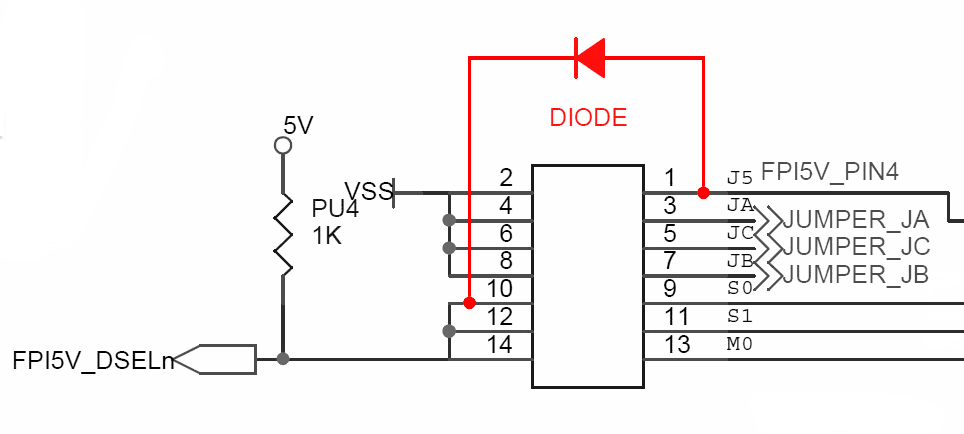

[**General Notes**](#general-notes)

**Computers**:
- [Acorn Archimedes](#acorn-archimedes)
- [Acorn BBC Micro](#acorn-bbc-micro)
- [Amstrad CPC](#amstrad-cpc)
- [Amstrad PCW](#amstrad-pcw)
- [Atari ST](#atari-st)
- [Commodore Amiga](#commodore-amiga)
- [DEC](#dec)
- [Dragon](#dragon)
- [IBM 3174](#ibm-3174)
- [IBM PC](#ibm-pc)
- [Memotech](#memotech)
- [MSX](#msx)
- [NEC PC-98](#nec-pc-98)
- [Sinclair QL](#sinclair-ql)
- [Spectrum](#spectrum)
- [Tandy Color Computer](#tandy-color-computer)
- [TI-99/4A](#ti-994a)
- [UKNC, DVK](#uknc-dvk)

**Electronic synthesizers**:
- [Akai](#akai)
- [E-mu ESI-32](#e-mu-esi-32)
- [Ensoniq](#ensoniq)
- [General Music (GEM)](#general-music-gem)
- [Korg](#korg)
- [Kurzweil](#kurzweil)
- [Roland](#roland)
- [Sequential Circuits Prophet 3000](#sequential-circuits-prophet-3000)
- [Yamaha DX7II-FD](#yamaha-dx7ii-fd)

## General Notes

Most systems require Shugart interface (the default) and select line 0
(jumper on S0). Such systems will work out of the box with a
factory-fresh Gotek programmed with FlashFloppy firmware, requiring
only a physical jumper at the rear to be moved from S1 to S0.

If this does not work then also try the following:
- Jumper at S1 only
- Jumpers at JC and S0
- Jumpers at JC and S1

If the system still does not work and the Gotek green LED is
permanently lit then you may need to try connecting the ribbon cable
'upside down'.

This gives a total of eight possible jumper/ribbon configurations to
try, and there are further instructions for certain specific systems
listed below.

A final note: In most cases FlashFloppy requires a straight floppy
cable with no 'twist' between the connectors. If you do use a twisted
cable, you should jumper MO instead of S0. The exception is the one
case that the twist was designed for: connecting FlashFloppy as Drive
B to a PC-compatible floppy header.

## Acorn Archimedes

Some later models, A5000 onward, use index pulses to determine
whether a disk is inserted in the drive. If you are seeing spurious
"drive empty" messages then add the following to FF.CFG:
```
index-suppression = no
```

Some HD-capable models after the A5000 (eg A3020) use
PC-compatible drives. These require the drive-select jumper at
position **S1**, and `interface = ibmpc` in FF.CFG.

To use ADFS D/E/F sector images, which usually have suffix ADF, you
must explicitly configure the host type in FF.CFG as Amiga sector
images share the same suffix:
```
host = acorn
```

Some ADF images may not be exactly the correct size (usually 800kB or
1.6MB) and thus not be detected as valid by FlashFloppy. These can be
modified to the exact correct size using the `dd` utility on Mac or
Linux. For example, for an 800kB image:
```
# dd if=/dev/zero of=fixed.adf bs=5120 count=160
# dd if=bad.adf of=fixed.adf bs=5120 count=160 conv=notrunc
```

## Acorn BBC Micro

BBC Micro systems using the original single-density 8271 controller
require regular index pulses to avoid disk-not-ready errors
([described here][bbc-problem]). These errors are reported on the
video screen as `Drive fault 10 at xx/xx`.

This issue is solved by specifying the following FF.CFG option:
```
index-suppression = no
```

## Akai

Akai systems require explicit configuration in FF.CFG to recognise IMG
files correctly:
```
host = akai
```

The correct jumper selection is usually S0, with the following
interface selections in FF.CFG, depending on model:

#### S2000, S3000XL:
```
interface = ibmpc-hdout
```

#### S950:
```
interface = akai-s950
```

#### S2800, S3000:
```
interface = akai-s950
pin34 = dens
```

#### S01:
```
interface = shugart
```

#### S1100:
S1100 sends a signal to the floppy drive on pin 2, hence this pin
must be configured `nc`:
```
interface = shugart
pin02 = nc
```

#### X7000
The [Quick Disk](Quick-Disk) version of the
FlashFloppy firmware has been tested working on X7000. Follow
the Quick Disk connection and installation instructions:
Note that you require a jumper at location **MO** only, and pin
ordering of the QD header is reversed.
No explicit configuration is required in FF.CFG.

## Amstrad CPC

FlashFloppy works with a wide range of CPC DSK images, however
compatibility is not perfect with copy-protected images. If you have
an original image which does not work, this is often due to 'GAPS
protection' where extra data is stored in the gaps between
sectors. These images can sometimes be fixed to work with
FlashFloppy by running a script included in the FlashFloppy
distribution, for example:
```
# python scripts/edsk_fix_gaps.py crazy_cars.dsk crazy_cars_fixed.dsk
```

#### Physical Connection of a Standard Gotek

See [here][cpc-pins] for guidance on connecting the CPC's 26-pin cable
to the Gotek 34-pin header. Also note that the CPC's power cable has
+5v and +12v reversed: you **must** use an adapter or otherwise
somehow insert the power connector backwards. If you do not, you will
**damage your Gotek** and **destroy any USB stick** that you insert!

Note that Gotek clones designed specifically for CPC (or Spectrum +3)
will use the data and power connectors as-is, and the above should be
ignored.

## Amstrad PCW

PCW uses a non-standard 26-pin header as described [here
(CPCWiki)][shugart-26], requiring an adapter to connect to the Gotek
34-pin header. Please note that this is **NOT** the same as the CPC
26-pin header, and if you use a CPC-compatible adapter or cable you
may damage your Gotek or your PCW!

#### Fixing Boot-Time Hangs

Later versions of LocoScript and CP/M require Drive A to correctly
respond to the Motor signal (Gotek pin 16), by deasserting Ready
(Gotek pin 34) when the motor is off. Unfortunately the Gotek usually
ignores Motor, and the PCW will hang during boot waiting for the drive
to respond correctly. [This page][pcw-hack] (in Italian, so use Google
Translate) explains how to modify the Gotek to fix this
problem. Section 8.3 of [this document][pcw-hw] gives more technical
information on the floppy-drive probe logic which causes this issue.

Alternatively, an option for correct motor emulation is provided in
FF.CFG: `motor-delay = 200`. Note that a standard Gotek needs a
[circuit modification](Hardware-Mods#motor-signal) to connect the
motor signal. This is an alternative to the extra external circuitry
described in the previous paragraph.

## Atari ST

No special configuration is required. Interface is Shugart (the default) and
drive-select jumper should typically be at position S0.

## Commodore Amiga

### Internal Drive (DF0)

To replace an existing Amiga internal drive usually requires a jumper
on S0 only. One exception are Escom A1200 boards, which are modded to
use PC drives: if you have one of these then you require a jumper on
JC (or `interface = ibmpc` in FF.CFG). For improved compatibility you
can undo the Escom mod as [described by RetroGameModz][a1200_mod].

### External Drive (DF1-DF3)

Replacing an external drive depends on the enclosure or cable being
used. Amiga external drive enclosures usually include the circuitry to
allow the Amiga to identify the presence of the drive. In this case
the Gotek with S0 jumper is usually a straight swap for the old floppy
drive. If using a passive cable such as this [Ebay item][amiga_cable]
then be aware that this identification circuitry is missing, but for
arcane reasons identification will typically happen to work as long as
the Gotek has an image mounted when the Amiga boots. If you are having
problems with your drive being identified, see
[Forcing Drive Identification](#forcing-drive-identification) below.

### High-Density Disks

Amiga Kickstart versions 2.05 and later support high-density disks
with 1760kB formatted capacity. This enhancement required a customised
(and nowadays expensive!) HD drive modified to rotate at half speed
and emit a special ID sequence to the Amiga when an HD disk is inserted.

FlashFloppy supports this enhancement for 1760kB ADF images, but the
high-density ID sequence must be [explicitly enabled in
FF.CFG](#forcing-drive-identification).

If using an Amiga external drive enclosure, please bear
in mind that the enclosure's interface board usually emits a fixed
double-density ID sequence which will make HD images unreadable. In
this case you must disconnect the enclosure's ID circuitry on its
interface PCB:
* Cut the PCB connection to external connector, pin 1.
* Connect a jumper wire between internal connector pin 34 and external
  connector, pin 1.

### Forcing Drive Identification

Amiga hosts expect a drive ID sequence from external and
Amiga-high-density drives on pin 34 of the floppy interface when the
drive motor is disabled (pin 34 carries the Ready/RDY signal
when the drive motor is enabled). In contrast, FlashFloppy's default
interface mode (`interface = shugart`) permanently attaches RDY
to pin 34, regardless of motor.

This default behaviour usually works fine:
* Drive ID signalling is not a strict requirement for DF0
* External drive enclosures often implement the drive-ID circuitry
* A mounted disk image asserts RDY which happens to
  match the Amiga ID sequence for a DD drive anyway

However, there are a couple of cases where this default behaviour may
*not* suffice:
* Using high-density disk images (1760kB formatted capacity)
* Using as an external drive with a passive interface cable, if
  FlashFloppy does not assert RDY during boot (eg. eject-at-power-on,
  no USB stick, or too slow to initialise)
  
In these cases FlashFloppy can be forced to emit the drive ID on pin
34 at all times, replacing RDY, by adding `interface = amiga` to
FF.CFG.

When HD images are not being used, and when FlashFloppy is being used
as DF0 or without problems as DF1-DF3, then it is best to use the
default interface type (`interface = shugart`) as this gives more
accurate behaviour on pin 34 in normal use while the drive motor is
enabled. Exact emulation of pin 34 behaviour is not possible on
unmodified Gotek hardware as the motor signal is not connected to
Gotek's microcontroller. More accurate support, for modified or
enhanced Gotek setups, may be implemented in future.

## DEC

DEC systems require `host = dec` in FF.CFG for correct IMG layout detection.
The RX33 and RX50 formats are supported.

## Dragon

No special configuration is required in order to use Dragon VDK disk
images.

If you wish to use DSK images for Tandy Coco, with appropriate ROM and
disk controller, then you will need `host = tandy-coco` in FF.CFG.

## E-mu ESI-32

Requires jumpers at S0 and JC. Works with 1.44MB (HD) IMG files.

## Ensoniq

Ensoniq systems use custom 800kB and 1600kB disk formats which are
supported as IMG files if the host-type is configured in FF.CFG:
```
host = ensoniq
```

The common EDE/EDA/EDS/EDT/EDV image formats are not directly supported
by FlashFloppy. These can be converted to HFE or IMG format using HxC
software. Notes:
* `host = ensoniq` is required in FF.CFG for IMG-format support
* IMG format is not supported for Mirage or SQ-80 (ie. 880kB) formats
* IMG format is especially preferred for 1600kB HD disks

**ASR, TS:** Some Ensoniq series (notably ASR and TS)
require an IBM-PC interface with density-select output. These require
a jumper on S0 **only**, and the following additional line in FF.CFG:
```
interface = ibmpc-hdout
```

**EPS:** Ensoniq EPS series typically requires a jumper on S0 **only**, and
the following lines in FF.CFG:
```
interface = shugart
chgrst = delay-3
```
The *chgrst* line requires v3.3a or later: disk changes
may not be detected reliably with earlier firmwares.

## General Music (GEM)

GEM systems using the 1.6MB high-density disk format require explicit
configuration in FF.CFG to recognise IMG files correctly:
```
host = gem
```

## IBM 3174

IBM 3174 establishment controllers require the following options in FF.CFG:
```
host = ibm-3174
interface = ibmpc
```

Select-line jumper S1 should be installed. The actual drive ID will be
determined by the interface cable.

A ready signal is required on pin 4 of the interface. This can be acheived
by connecting a diode between pin 1 and 10 of the jumper block
as shown below:



If only a single drive is present then you can install jumper J5 instead
of the diode which will cause the ready signal to be permanently asserted.

## IBM PC

IBM PC compatibles have a non-Shugart interface which must be explicitly
configured in FlashFloppy:
* IBM-PC interface mode must be configured
  * Strap jumper JC at the rear of the Gotek; **or**
  * Specify via FF.CFG: `interface = ibmpc`
* Strap select-line jumper S1 at the rear of the Gotek
  * S0, S2, MO should all be left open

Please note that some IBM PC clones, although software compatible, use
the Shugart interface for their floppy drives. These typically require
a jumper at S0 only. Known models this affects include:
* Amstrad PPC512, PPC640

## Korg

Korg synths require `host = akai` in FF.CFG for correct IMG layout detection.

## Kurzweil

Kurzweil K2500 requires jumpers at S0 and JC. This is likely to apply
across the entire K range.

## Memotech

Memotech systems require the following options in FF.CFG:
```
host = memotech         # auto-detect IMG layout
index-suppression = no  # SDX/FDX require regular index pulses 
```

## MSX

MSX systems require `host = msx` in FF.CFG for correct IMG layout detection.

## NEC PC-98

PC-98 FDI and HDM disk images are supported directly. For raw IMG files
(rare), `host = pc98` needs to be set in FF.CFG.

For most machines the default Shugart interface is correct (jumper
only at position S0 at rear of Gotek). Internal pinout varies between
PC-98 machines but many use a 26-pin laptop floppy drive
connector. Appropriate adapters can be sourced from eBay or wired
directly as follows:
```
(26-pin) -> (34-pin + power)
1 -> 5V
2 -> 8
4 -> 10
6 -> 2
7 -> 12
8 -> 34
10 -> 16
12 -> 18
14 -> 20
15 -> GND
16 -> 22
18 -> 24
20 -> 26
22 -> 28
24 -> 30
26 -> 32
```

## Roland

Roland synths typically work out of the box with no special configuration
required in FF.CFG, and a jumper at position S0 only at the rear of the Gotek.

**MT-120:** This synth is reported to require jumpers at **S0** and
            **MO**, and `pin02 = high` in FF.CFG.

**MKS-100, MT-100, PR-100, S-10, S-20:** The [Quick Disk](Quick-Disk)
version of the
FlashFloppy firmware has been tested working on these samplers. Follow
the Quick Disk connection and installation instructions,
and note that you require jumpers at locations **MO** and **JC**.

## Sequential Circuits Prophet 3000

Requires `host = akai` in FF.CFG for correct IMG layout detection.

## Sinclair QL

The QL has been tested to work with IMG files on all of the
floppy interfaces tried so far: Sandy Q-Board, Miracle Systems Trump
Card, and Super Gold Card.  FF.CFG needs to be configured as follows,
otherwise formatting will not work and HD disks won't work on the
Super Gold Card (even if FLP_DENSITY is used to manually set the disk
type):
```
interface = shugart
pin02 = dens
```

All other drive-related settings should be left at their default values.

Note that all interfaces which use the default Q-Jump Toolkit II
version of the FORMAT command fail to determine the correct number of
sides on in a floppy image and hence format single sided, giving 720
sectors rather than the expected 1440. However, if a pre-formatted
image generated by dumping a real floppy or from an emulator is used
then everything works. This is due to a trick used by the command to
determine the number of sides only working on real hardware, or when
using the HFE image format.

The version of FORMAT on the Miracle Systems Gold Card and Super Gold
Card use a different algorithm and work correctly.  It is unknown if
the FORMAT command in SMSQ/e running on a Super Gold Card works or
not.

You cannot format ED disk images but with the following entry in
IMG.CFG you can read and write to pre-formatted IMG images with the
file suffix **.qled.img**:
```
[qled]
cyls = 80
heads = 2
secs = 10
bps = 2048
```

Images can be generated using the
[Qltools utility](https://github.com/NormanDunbar/qltools/releases)
in the following manner:

Double-sided, double-density: `qltools myimage.img -fdd DSKLABEL`

Double-sided, high-density: `qltools myimage.qlhd.img -fhd DSKLABEL`

Double-sided, extended-density: `qltools myimage.qled.img -fed DSKLABEL`

Qltools is available as a pre-built binary for Linux and Windows and will
build with minor modifications on macOS using the Xcode command line
tools up to macOS Mojave (Catalina onwards support only 64-bit
executables).

## Spectrum

FlashFloppy boasts 100% compatibility with the TOSEC collection of DSK
images, however some are missing 'weak sector' information and must be fixed
up before use. If you find a game title fails to boot then you can fix
the image in two ways.

1. Using Simon Owen's [SAMdisk][samdisk]
```
# SAMdisk robocop.dsk robocop_fixed.dsk --fix
```

2. Using the Python script included in the FlashFloppy distribution
```
# python scripts/edsk_fix_speedlock.py robocop.dsk robocop_fixed.dsk
```

#### Spectrum +3: Physical Connection of a Standard Gotek

See [here][cpc-pins] for guidance on connecting the Spectrum +3's 26-pin cable
to the Gotek 34-pin header. Also note that the +3's power cable has
+5v and +12v reversed: you **must** use an adapter or otherwise somehow insert
the power connector backwards. If you do not, you will **damage your Gotek**
and **destroy any USB stick** that you insert!

Note that Gotek clones designed specifically for CPC and Spectrum +3
will use the data and power connectors as-is, and the above should be
ignored.

## Tandy Color Computer

Requires `host = tandy-coco` in FF.CFG to indentify DSK images as JVC format.

## TI-99/4A

Requires `host = ti99` in FF.CFG to identify DSK images as V9T9 format.

## UKNC, DVK

These Soviet PDP-11 clones have a modified IBM track format which must
be explicitly configured via `host = uknc` in FF.CFG.

## Yamaha DX7II-FD

This vintage synthesizer uses an old drive type with an explicit
Disk Change Reset signal on pin 1 of the ribbon cable. This requires
a hardware modification to the ribbon cable or Gotek, as described in the
[Hardware Mods](Hardware-Mods#disk-change-reset).

It also requires the following line in FF.CFG:
```
chgrst = pa14
```

Please note that this feature is supported only in FlashFloppy v3.x releases.

[a1200_mod]: https://www.youtube.com/watch?v=G6fYOjTYvXM
[amiga_cable]: https://www.ebay.co.uk/itm/272363110859
[bbc-problem]: http://www.sprow.co.uk/bbc/floppydrives.htm
[cpc-pins]: http://www.cpcwiki.eu/index.php/DIY:Floppy_Drives
[samdisk]: http://simonowen.com/samdisk/
[shugart-26]: http://www.cpcwiki.eu/forum/amstrad-cpc-hardware/gotek-(flashfloppy)-wiring-for-a-pcw9512
[pcw-hack]: https://fabriziodivittorio.blogspot.com/2018/05/installazione-gotek-su-amstrad-pcw-9512.html
[pcw-hw]: https://www.seasip.info/Unix/Joyce/hardware.pdf
