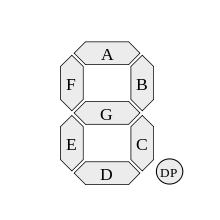

The Gotek components and I/O pins are sensitive to over-voltage and static
discharge. An alternative firmware is provided to allow you to test the
Gotek inputs and outputs for correct function.

### Programming the I/O Test Firmware

Follow steps for [Firmware Update](Firmware-Update) but use the update
file contained in the **alt/io-test** subfolder of the FlashFloppy
distribution.

**NOTE:** Please update back to the normal firmware after diagnosing
your issue.

### Using the I/O Test Firmware

All outputs at the 34-pin floppy header are toggled every two seconds.
When the outputs toggle, a short pulse is sent to jumper JB to test
the buzzer or speaker (if attached).

Meanwhile all inputs are continually sampled and their current states
are printed on the Gotek display. All inputs are HIGH by default (except
two inputs which are unconnected on a standard unmodified
Gotek, and are held permanently LOW). When you connect an input to
Ground (eg via a wire, or by pressing a button) this should be immediately
be reflected on the display. When you connect an input to an output, it
should toggle with the output, thus verifying correct operation of both I/O
lines.

Inputs are represented on the display as follows. The representation differs
between [LCD/OLED](#lcd-and-oled) and standard [7-segment LED](#7-segment-led)
displays.

| LCD | LED | Input Assignment | Pin / Jumper | Notes |
|--------|---------|------------------|---------|---|
| 0 | 1-A | Drive Select A | See note | **1** |
| 1 | 1-B | Drive Select B | - | **2** | 
| 2 | 1-C | Motor On       | Floppy-16 | **2** |
| 3 | 1-D | Direction | Floppy-18 |
| 4 | 1-E | Step | Floppy-20 |
| 5 | 1-F | Write Data | Floppy-22 |
| 6 | 1-G | Write Gate | Floppy-24 |
| 7 | 2-A | Side/Head Select | Floppy-32 |
| 8 | 2-B | Button: Down/Left | - |
| 9 | 2-C | Button: Up/Right | - |
| A | 2-D | Button: Select | JA |
| B | 2-E | Rotary CLK | J7-1 |
| C | 2-F | Rotary DAT | J7-2 |

- **1:** Floppy pin 10, 12 or 16 depending on S0/S1/MO jumper setting on standard Gotek
- **2:** Not connected on a standard unmodified Gotek, and will always read LOW

#### 7-Segment LED

Individual segments of the first two digits of the display correspond
to individual Gotek inputs. A segment is illuminated only when the
corresponding input is HIGH. Segment G of digits 2 and 3 are illuminated
only when outputs are HIGH.

The segments are conventionally identified by letters **A-G** as follows:

#### LCD and OLED

First row is **0123456789ABC**, corresponding to each of the 13 inputs.
Only the inputs which are currently HIGH have their corresponding characters
printed. Inputs which are LOW are represented by a blank space.

Second row displays **LO** while outputs are LOW, and **HI 888** while
outputs are HIGH.

#### Floppy Header Pins

For your reference, the Gotek floppy header has the following pin
assignments:

| Pin | Signal | Pin | I/O | Signal |
|-----|--------|-----|-----|--------|
|  1  | Ground |  2  | O   | Disk Change / Density |
|  3  | Ground |  4  | -   | Reserved |
|  5  | Ground |  6  | -   | Reserved |
|  7  | Ground |  8  | O   | Index |
|  9  | Ground | 10  | I   | Drive Select 0 |
| 11  | Ground | 12  | I   | Drive Select 1 |
| 13  | Ground | 14  | -   | Reserved |
| 15  | Ground | 16  | I   | Motor On |
| 17  | Ground | 18  | I   | Direction |
| 19  | Ground | 20  | I   | Step |
| 21  | Ground | 22  | I   | Write Data |
| 23  | Ground | 24  | I   | Write Gate |
| 25  | Ground | 26  | O   | Track 0 |
| 27  | Ground | 28  | O   | Write Protect |
| 29  | Ground | 30  | O   | Read Data |
| 31  | Ground | 32  | I   | Side/Head Select |
| 33  | Ground | 34  | O   | Disk Change / Ready |
