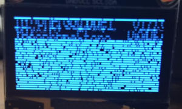
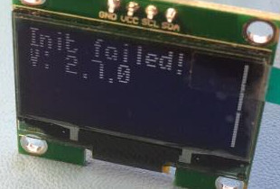
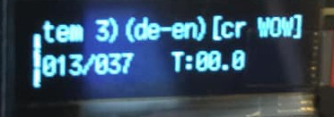

- [General](#general)
- [OLED Displays](#oled-displays)
- [Commodore Amiga](#commodore-amiga)
- [Raw Images (IMG/IMA)](#raw-images-imgima)
- [Image Formats](#image-formats)

## General

- **My Gotek will only display 'F-F'**
  - This is the default display if a valid USB stick is not inserted.
  If you have inserted a stick then either FlashFloppy does not
  recognise it (try another stick) or the stick is not suitably
  formatted -- be sure that the stick is legacy partitioned (MBR
  rather than GPT), and FAT32 formatted.

- **My Gotek will only display 'FlashFloppy' and version number**
  - This is equivalent to the above problem, but with an LCD/OLED display.
  See answer above.
  
- **My Gotek will only display 'UPD'**
  - FlashFloppy is stuck in its update bootloader. This is usually because
  you have a short from jumper JA to ground. Check that jumpers are installed
  correctly at the rear of the Gotek. Also check the underside of the Gotek
  PCB for shorts (eg. solder blobs).

- **My Gotek will only display 'FF Update Flash'**
  - This is equivalent to the above problem, but with an LCD/OLED display.
  See answer above.
  
- **My Gotek does not recognise any USB stick that I insert, and then
afterwards they all fail to work even in a PC**
  - You are feeding more than 5 volts power to the Gotek, and frying
all your USB sticks! This is commonly because either the connector is
inserted upside down, or because of a non-standard connector (eg
Amstrad CPC, Spectrum +3). Either way you fed 12 volts to the
Gotek. It usually survives, but USB sticks are instantly killed.

## OLED Displays

- **My OLED display shows garbage**  

  - Upgrade to latest stable firmware release. You will also need to
  [update the bootloader](Firmware-Update#updating-the-bootloader) to
  get a corect display during future firmware updates (although if you
  don't, the bootloader will still work even while displaying garbage!).
  - If your display is 128x64 then this must also be explicitly
  configured, or your display may be misaligned or
  display only every other row: `display-type=oled-128x64`.

- **My OLED display illuminates only every other row**  

  - You have a 128x64 OLED display, which by default is driven as
  128x32. You must explicitly configure the display size in FF.CFG:
  `display-type=oled-128x64`.

- **My OLED display shows a vertical bar at the left or right side**  

  - Make sure the display size (128x32 or 128x64) is correctly configured
  in FF.CFG.
  - Try the latest firmwares in both the stable and experimental
  release series.
  - If either or both of the latest firmwares do not display
  correctly, raise a ticket on the [issue tracker][issue-tracker], or
  raise a question on the [Facebook group][facebook].


## Commodore Amiga

- **I installed a Gotek in my A1200 but it will not recognise
any floppy images**
  - Assuming your Gotek is properly jumpered (S0 only) then this is
usually because you have an Escom motherboard. Please check out
[this informative Youtube video][a1200_mod].

- **I installed a Gotek as external drive, but I cannot read from it**
  - If you have Kickstart v2 or later, try booting Workbench from the
Gotek. Or if you have a DF0/DF1 switch, select the Gotek as DF0 and
try booting any bootable disk. If the Gotek fails to boot, but
succeeds if you unplug the internal drive, then it's probably a
PC drive that has been hacked to work with Amiga: Check the drive's
circuit board around the 34-pin header to see if it has been modified
(in particular, whether pins 30 and 34 are wired together). If so,
this modification does not support multiple drives and you must remove
the hack or replace it with a germanium diode (cathode to pin 30).

- **The AUTOBOOT file selector does not recognise my Gotek drive**
  - First please make sure you are running latest firmware and
AUTOBOOT (both are included in the [latest release](Downloads)).
If the problem persists then the drive's READY signal is probably
not reaching the Amiga. You can test this by booting [SysTest][systest],
running the floppy read test, and check for the "no READY signal" warning.
In this case either your ribbon cable is worn out, or you have an Escom
board in need of further modding (check out the additional jumper wire
in [this Youtube video][a1200_mod]).

[a1200_mod]: https://www.youtube.com/watch?v=G6fYOjTYvXM
[systest]: https://github.com/keirf/Amiga-Stuff/blob/master/README.md

## Raw Images (IMG/IMA)

- **Images work but are much slower than a real floppy drive (half speed
or worse)**
  - The host probably expects sectors to be interleaved (non-sequential)
within a track, and/or to be skewed (sector 1 at a variable offset) across
tracks. Interleave and skew can be adjusted via a custom track layout
in [IMG.CFG](IMG.CFG-Configuration-File).

- **In IMG.CFG, how do I work out what interleave and skew values to use?**
  - Many systems require neither and you can use the default 0
values. If your disk accesses are very slow (see previous question)
then try adjusting *cskew* incrementally until you see a performance
increase. Then repeat for *interleave*. A very few systems require
*sskew* too, but this is rare. If you have access to an HFE image that
works at correct speed, you can check for interleave and skew in the
Track-Analyser visualiser in the HxC software suite for Mac and
Windows.

## Image Formats

- **Can you support IMD images?**
  - Unfortunately IMD is an archive format which is not convenient for
directly accessing specific tracks or sectors, as required by FlashFloppy
(IMD files are expected to be read sequentially, from start to finish).
Hence support is unlikely to ever materialise. Straightforward images can
be converted to IMG format. Trickier images should be converted to HFE.

- **Can you support compressed images?**
  - Compressed files are not convenient for fast random access, nor for
writes. Generally they are intended for archiving rather than emulation.

- **Can you support DMS/ADZ/...?**
  - No. See above.

- **Can you support Pasti/STX for Atari ST copy-protected disks?**
  - No, it would be very difficult to achieve even close to 100% coverage
  of all STX images, as this is a format that is particularly convenient
  for emulators rather than reproducing the original track bitstream.
  The best bet is to try conversion to HFEv3, although even this is far
  from 100% supported for all STX images.

- **Can you support EADF (Extended ADF) images for Amiga?**
  - I could, but I'm unlikely to bother as there is no great need.
  I only know of one original game distributed by the publisher in
  EADF format (BC Kid / Factor 5): this can be converted to HFE in
  the usual way. Some games (such as Cannon Fodder) have a custom save
  disk format, supported in WinUAE by using an
  EADF image. FlashFloppy achieves the same by instead using a blank HFE
  image, which can be created in a number of ways, including via a
  script shipped with FlashFloppy:
  ```
  python scripts/mk_hfe.py save_blank.hfe
  ```  

[issue-tracker]: https://github.com/keirf/FlashFloppy/issues
[facebook]: https://www.facebook.com/groups/flashfloppy/
